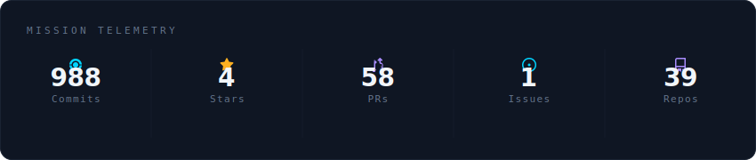

##  Hello, world! 🌎

Olá, me chamo **Caio Machado**, tenho 20 anos e sou apaixonado pelo universo da tecnologia. Desde a infância, sempre fui curioso sobre como os computadores funcionam e essa curiosidade me levou a descobrir o mundo da programação.

Desde **2020**, tenho me dedicado intensamente ao estudo da programação e à busca de conhecimento na área de tecnologia. Atualmente, sou estudante de **Sistemas de Informação - 6° Período**, e estou focado em desenvolver minhas habilidades em **back-end**.

  
 

 

  

 

  

 

  

 

  

 

<h2 align="center">Skills 🚀</h2>

 
  &nbsp;
  &nbsp;
  &nbsp;
  &nbsp;
  &nbsp;
  &nbsp;
  &nbsp;
  &nbsp;
  &nbsp;
  &nbsp;

---

  ✨ Os banners acima são atualizados automaticamente a cada 12 horas via GitHub Actions

